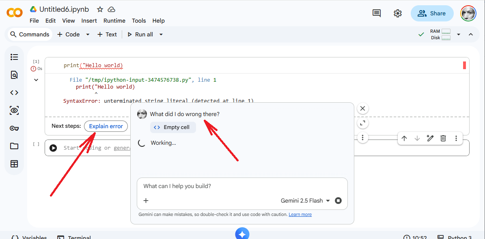

# DATA5000 Colab Notebooks

👉 Start here (30 seconds):

- Click your week’s link
- In Colab: File → Save a copy in Drive
- If errors: Runtime → Restart runtime (then Run all)


🤔 If you get stuck:

In-browser AI-assisted support is quite extensive and often very helpful - see the image below (click it to zoom in).

<a href="SyntaxError.png">
  
</a>

If you don't see all the AI-assisted support options, you can enable them using <B><I>this</I></B> button at the bottom (centre) of your browser:


If you’re still stuck after ~2 minutes, raise your hand 🙋 and ask! (*include week #, cell #, the full error message, and a screenshot if possible*).

## ASSESSMENT A3 

- Assessment A3 materials: [`A3 NOTEBOOK`](https://colab.research.google.com/github/clarkian-teachings/data5k/blob/main/assessments/DATA5000_A3.ipynb), datasets: [`sales_data.xlsx`](https://raw.githubusercontent.com/clarkian-teachings/data5k/main/assessments/sales_data.xlsx) and [`customer_reviews.csv`](https://raw.githubusercontent.com/clarkian-teachings/data5k/main/assessments/customer_reviews.csv) 

## Teaching Notebooks (for weekly practice and revision)

- Week 1: [`week_1_notebook.ipynb`](https://colab.research.google.com/github/clarkian-teachings/data5k/blob/main/week_01/week_1_notebook.ipynb) and data [`aus_cpi.csv`](https://raw.githubusercontent.com/clarkian-teachings/data5k/main/week_01/aus_cpi.csv)
- Week 2 (Notebook 1): [`week_2_1_notebook.ipynb`](https://colab.research.google.com/github/clarkian-teachings/data5k/blob/main/week_02/week_2_1_notebook.ipynb)
- Week 2 (Notebook 2): [`week_2_2_notebook.ipynb`](https://colab.research.google.com/github/clarkian-teachings/data5k/blob/main/week_02/week_2_2_notebook.ipynb)
- Week 3 (Notebook 1): [`week_3_1_notebook.ipynb`](https://colab.research.google.com/github/clarkian-teachings/data5k/blob/main/week_03/week_3_1_notebook.ipynb)
- Week 3 (Notebook 2): [`week_3_2_notebook.ipynb`](https://colab.research.google.com/github/clarkian-teachings/data5k/blob/main/week_03/week_3_2_notebook.ipynb) 
- Week 4: [`week_4_notebook.ipynb`](https://colab.research.google.com/github/clarkian-teachings/data5k/blob/main/week_04/week_4_notebook.ipynb)
- Week 5: [`week_5_notebook.ipynb`](https://colab.research.google.com/github/clarkian-teachings/data5k/blob/main/week_05/week_5_notebook.ipynb) 
- Week 6 (Notebook 1): [`week_6_1_notebook.ipynb`](https://colab.research.google.com/github/clarkian-teachings/data5k/blob/main/week_06/week_6_1_notebook.ipynb) 
- Week 6 (Notebook 2): [`week_6_2_notebook.ipynb`](https://colab.research.google.com/github/clarkian-teachings/data5k/blob/main/week_06/week_6_2_notebook.ipynb) 
- Week 8: [`week_8_notebook.ipynb`](https://colab.research.google.com/github/clarkian-teachings/data5k/blob/main/week_08/week_8_notebook.ipynb) and data [`TeleConnect.csv`](https://raw.githubusercontent.com/clarkian-teachings/data5k/main/week_08/TeleConnect.csv)
- Week 10: [`week_10_notebook.ipynb`](https://colab.research.google.com/github/clarkian-teachings/data5k/blob/main/week_10/week_10_notebook.ipynb)

## Supplementary Notebooks (for reference)

- [`Workbook 1 - Getting Started with Python & Google Colab`](https://colab.research.google.com/github/clarkian-teachings/clarkian-python-ml-intro/blob/main/notebooks/Python_Teaching_Workbook_1.ipynb)
- [`Workbook 2 - Fitting and Overfitting`](https://colab.research.google.com/github/clarkian-teachings/clarkian-python-ml-intro/blob/main/notebooks/Python_Teaching_Workbook_2.ipynb)
- [`Workbook 3 - Putting the Data in Data Science`](https://colab.research.google.com/github/clarkian-teachings/clarkian-python-ml-intro/blob/main/notebooks/Python_Teaching_Workbook_3.ipynb)

## Assessment notebooks

- Assessment A1 materials: [`A1 NOTEBOOK`](https://colab.research.google.com/github/clarkian-teachings/data5k/blob/main/assessments/DATA5000_A1.ipynb)
- Assessment A2 materials: [`A2 NOTEBOOK`](https://colab.research.google.com/github/clarkian-teachings/data5k/blob/main/assessments/DATA5000_A2.ipynb), datasets: [`facebook_data.csv`](https://raw.githubusercontent.com/clarkian-teachings/data5k/main/assessments/facebook_data.csv) and [`instagram_data.csv`](https://raw.githubusercontent.com/clarkian-teachings/data5k/main/assessments/instagram_data.csv) 
- Assessment A3 materials: [`A3 NOTEBOOK`](https://colab.research.google.com/github/clarkian-teachings/data5k/blob/main/assessments/DATA5000_A3.ipynb), datasets: [`sales_data.xlsx`](https://raw.githubusercontent.com/clarkian-teachings/data5k/main/assessments/sales_data.xlsx) and [`customer_reviews.csv`](https://raw.githubusercontent.com/clarkian-teachings/data5k/main/assessments/customer_reviews.csv) 


This repository contains **updated, instructor-checked versions** of the weekly notebooks used in DATA5000, plus links to some of Iain Clark's personal training materials.
These materials are provided solely as supplementary teaching support and do not replace the official materials.

---

Official Google Welcome to Colab page
https://colab.research.google.com/

Google Colab AI (NEW)
https://colab.research.google.com/github/googlecolab/colabtools/blob/main/notebooks/Getting_started_with_google_colab_ai.ipynb

---

## ⚖️ Source and Licence

These notebooks are adapted from the open-source repository:  
https://github.com/data-5000/data5000

The upstream materials were released under the **MIT Licence**, which permits
copying, modification, redistribution, and reuse.

**Source material © data-5000/data5000 (MIT Licence); Supplementary Notebooks © Iain J. Clark.**  

All modified content in this repository is also provided under the MIT Licence.

No assessment materials or Kaplan-owned documents are included.

---

## 📁 Repository Structure

```
data5k/
├── assessments/    
├── week_00/        # Reserved for pre-course compatibility checks
├── week_01/
├── week_02/
├── week_03/
├── ...
├── week_12/
├── README.md
└── LICENSE
```

---